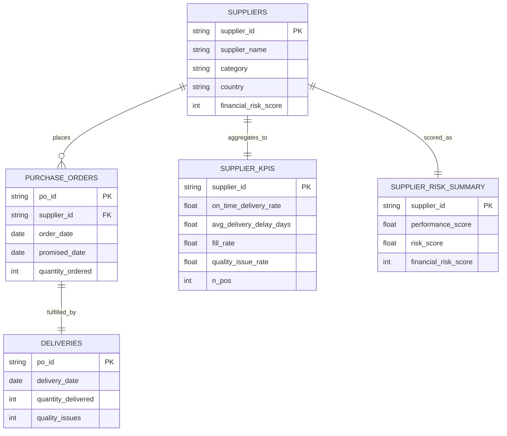

# Supplier Performance & Risk Pipeline

This project is an end-to-end **data engineering capstone** that simulates a realistic procurement analytics workflow: from raw operational data to supplier KPIs, risk scoring, and an interactive dashboard.

The goal is to demonstrate how raw procurement events can be transformed into **decision-ready supplier risk insights** using a lightweight but complete data pipeline, including optional orchestration with Airflow.

👉 **Live dashboard demo:** [https://flavia-capstone-project.streamlit.app/](https://flavia-capstone-project.streamlit.app/)

---

## Project Overview

Procurement teams need to understand which suppliers are reliable and which pose operational or financial risk.

This project:

* Generates **synthetic but realistic procurement data**
* Loads it into an **analytical warehouse (DuckDB)**
* Computes **supplier-level KPIs**
* Combines operational performance with **financial risk** into a single risk score
* Exposes the results via an **interactive Streamlit dashboard**
* Optionally orchestrates the pipeline using **Apache Airflow**

The scope is intentionally minimal but complete, focusing on clarity, explainability, and sound data-engineering trade-offs.

---

## Data Model

The pipeline is built around five core tables:



**Interpretation**

* `suppliers` is master data
* `purchase_orders` represent planned demand
* `deliveries` represent execution
* KPI and risk tables are **derived aggregations** at supplier level

---

## Pipeline Architecture

Synthetic CSVs
↓
DuckDB warehouse
↓
Supplier KPIs
↓
Risk scoring
↓
Streamlit dashboard

---

## Pipeline Steps

### 1. Data Generation

Synthetic datasets are generated for:

* suppliers
* purchase orders
* deliveries

Supplier behavior (lateness, partial delivery, quality issues) is probabilistic and supplier-specific, making the data realistic rather than purely random.

---

### 2. Warehouse (DuckDB)

All CSVs are loaded into a local DuckDB database with explicit schemas.

Basic integrity checks ensure:

* every purchase order has exactly one delivery
* no orphan records exist

DuckDB was chosen as an **embedded analytical database** well suited for local OLAP-style workloads.

---

### 3. KPI Computation

KPIs are computed per supplier:

* On-time delivery rate
* Average delivery delay (days)
* Fill rate
* Quality issue rate
* Number of purchase orders

---

### 4. Risk Scoring

KPIs are normalized and combined into a performance score.

Final risk score:

```text
risk_score =
  0.7 × (1 − performance_score)
+ 0.3 × (financial_risk_score / 100)
```

**Explanation**

* `performance_score` summarizes operational behavior and is scaled from 0 (excellent) to 1 (very poor)
* `1 − performance_score` converts performance into *operational risk*
* `financial_risk_score` is a synthetic external signal (0–100)
* Weights reflect the assumption that **operational behavior matters more than financial background**

**Risk interpretation**

| risk_score | interpretation |
| ---------: | -------------- |
|    0.0–0.2 | low risk       |
|    0.2–0.5 | medium risk    |
|    0.5–0.8 | high risk      |
|    0.8–1.0 | critical risk  |

---

## 5. Dashboard

A one-page Streamlit app provides:

* Supplier ranking by risk
* KPI tables with filters
* Charts for top-risk suppliers
* Drill-down into individual suppliers
* Built-in DuckDB table viewer

The dashboard allows users to:

* Filter suppliers by category, country, and volume
* Compare KPIs across suppliers
* Identify the highest-risk suppliers quickly
* Inspect underlying warehouse tables directly

👉 **Live demo:** [https://flavia-capstone-project.streamlit.app/](https://flavia-capstone-project.streamlit.app/)

---

## Optional: Airflow Orchestration (Extension)

As an extension, the pipeline can be orchestrated using **Apache Airflow**.

### What Airflow Adds

* Scheduled execution (e.g. daily runs)
* Explicit task dependencies
* Automatic retries on transient failures
* Centralized logs and monitoring
* Visual DAG representation

Each pipeline step runs as a separate Airflow task:

1. Generate synthetic data
2. Load data into DuckDB
3. Compute supplier KPIs
4. Compute supplier risk scores

The Airflow setup uses:

* LocalExecutor
* Postgres as the metadata database
* Docker Compose for reproducible local execution

### Run with Airflow (Optional)

**Prerequisites:** Docker Desktop (Linux / WSL2 engine enabled)

```bash
mkdir -p dags logs plugins

docker compose -f docker-compose.airflow.yml up -d
```

Open Airflow UI:

* [http://localhost:8080](http://localhost:8080)
* user: `admin`
* password: `admin`

Trigger the DAG `supplier_performance_pipeline` manually or wait for the schedule.

> Note: Airflow is included to demonstrate orchestration design. For this project’s scope (single-node, batch pipeline), orchestration is optional but illustrates how the pipeline would scale in production.

---

## Tech Stack

* Python
* DuckDB – analytical warehouse
* Pandas – data manipulation
* Streamlit – interactive dashboard
* Apache Airflow – orchestration (optional)
* Docker / Docker Compose – local infrastructure
* Git / GitHub – version control & deployment

---

## How to Run Without Airflow (Scripts Only)

```bash
git clone https://github.com/Flazoukie/supplier-performance-data-pipeline.git
cd supplier-performance-data-pipeline
pip install -r requirements.txt
```

Run the pipeline:

```bash
python src/generate_data.py
python src/load_duckdb.py
python src/compute_kpis.py
python src/compute_risk.py
```

Run the dashboard:

```bash
streamlit run dashboard/app.py
```
