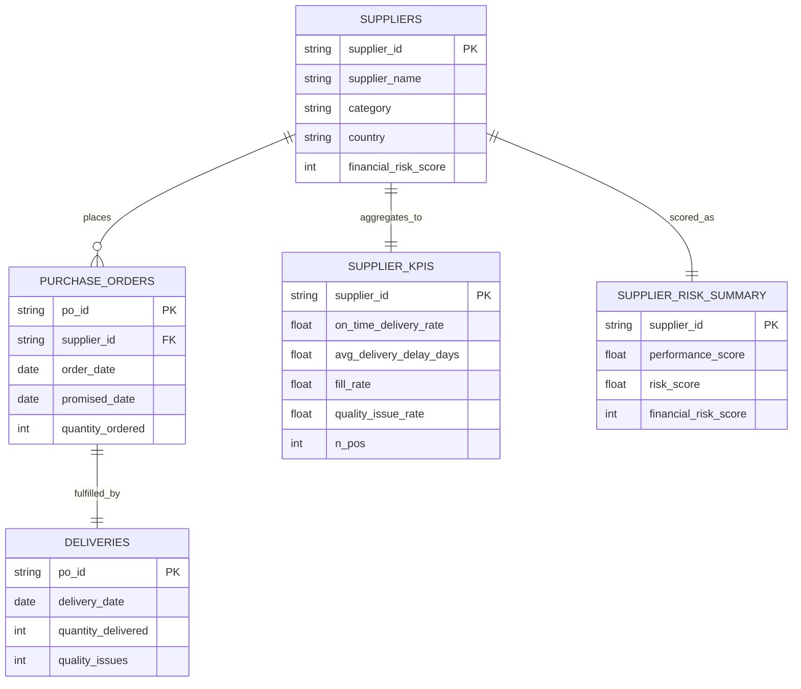

# Supplier Performance & Risk Pipeline

This project is an end-to-end **data engineering capstone** that simulates a realistic procurement analytics workflow: from raw operational data to supplier KPIs, risk scoring, and an interactive dashboard.

The goal is to demonstrate how raw procurement events can be transformed into **decision-ready supplier risk insights** using a lightweight but complete data pipeline.

👉 **Live demo:** https://flavia-capstone-project.streamlit.app/

---

## Project Overview

Procurement teams need to understand which suppliers are reliable and which pose operational or financial risk.

This project:
- Generates **synthetic but realistic procurement data**
- Loads it into an **analytical warehouse**
- Computes **supplier-level KPIs**
- Combines operational performance with **financial risk** into a single risk score
- Exposes the results via an **interactive Streamlit dashboard**

The scope is intentionally minimal but complete, focusing on clarity, explainability, and good data-engineering practices.

---

## Data Model

The pipeline is built around five core tables:



Interpretation

- ``suppliers`` is master data
- ``purchase_orders`` represent planned demand
- ``deliveries`` represent execution
- ``KPI and risk`` tables are derived aggregations at supplier level

## Pipeline Architecture

Synthetic CSVs
   ↓
DuckDB warehouse
   ↓
Supplier KPIs
   ↓
Risk scoring
   ↓
Streamlit dashboard

### 1. Data Generation

Synthetic datasets are generated for:

- suppliers
- purchase orders
- deliveries

Supplier behavior (lateness, partial delivery, quality issues) is probabilistic and supplier-specific, making the data realistic rather than purely random.

### 2. Warehouse (DuckDB)

All CSVs are loaded into a local DuckDB database with explicit schemas.
Basic integrity checks ensure:

- every purchase order has exactly one delivery
- no orphan records exist (row referencing something not existing in another table)

### 3. KPI Computation

KPIs are computed per supplier:

- On-time delivery rate
- Average delivery delay (days)
- Fill rate
- Quality issue rate

### 4. Risk Scoring

KPIs are normalized and combined into a performance score.

Final Risk Score:

```diff
risk_score =
  0.7 × (1 − performance_score)
+ 0.3 × (financial_risk_score / 100)
```

This balances **operational performance** with **financial risk** in a transparent, explainable way.

In more details:

- **performance _score** summarized how well a supplier performes *operationally*, based on the KPIs (on-time delivery, delivery delay, fill rate, and quality issues). It is scaled between 0 and 1 (excellent to very poor).

Here we use 1 - performance_score because we are interested in the risk (not in the performance), so teh risk is the difference between 1 (best possible performance_score) and the actual performance_score of the supplier.

- **financial_risk_score** is an external risk indicator, which does not coem from our dataset but from, e.g.,
 - credit score
 - country risk
 - supplier stability score

    It ranges from 0 to 100 (0 = safe, 100 = financially very risky).

We use fianncial_risk_score / 100 to compare it with the other numbers (ranging 0 - 1).

- **weights** 0.7 and 0.3:

We decided that operational behavior matters more than the fianncial risk score, so we assigned weights 0.7 and 0.3 respectively. That means:

- 70% of teh risk comes from what teh supplier actually does
- 30% of the risk comes form the financial background

**What the final score means**

| risk_score | interpretation |
| ---------- | -------------- |
| 0.0–0.2    | low risk       |
| 0.2–0.5    | medium risk    |
| 0.5–0.8    | high risk      |
| 0.8–1.0    | critical risk  |


## 5. Dashboard

A one-page Streamlit app provides:

- Supplier ranking by risk
- KPI tables with filters
- Charts for top-risk suppliers
- Drill-down into individual suppliers
- Built-in DuckDB table viewer

**Dashboard Preview**

The dashboard allows users to:

- Filter suppliers by category, country, and volume
- Compare KPIs across suppliers
- Identify the highest-risk suppliers quickly
- Inspect underlying warehouse tables directly

👉 Live demo: https://flavia-capstone-project.streamlit.app/

## Tech Stack

- Python
- DuckDB – analytical warehouse
- Pandas – data manipulation
- Streamlit – interactive dashboard
- Git / GitHub – version control & deployment

## How to Run Locally

git clone https://github.com/Flazoukie/supplier-performance-data-pipeline.git
cd supplier-performance-data-pipeline
pip install -r requirements.txt

**Generate data and build the warehouse:**
python src/generate_data.py
python src/load_duckdb.py
python src/compute_kpis.py
python src/compute_risk.py

**Run the dashboard:**
streamlit run dashboard/app.py
